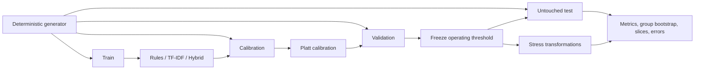

# Agent Threat Detection Lab

A reproducible applied-AI security research project for detecting attacks in structured agent traces.

The repository now contains a real experimental pipeline, not only a roadmap: a deterministic 960-trace benchmark, leakage-isolated train/calibration/validation/test splits, rules and statistical baselines, held-out calibration, operational threshold selection, group-bootstrap uncertainty, stress tests, slice metrics, error analysis, and generated decision documents.

## Current research result

The benchmark asks whether a detector can generalize to **unseen language templates** while preserving a 90% precision requirement selected on validation data.

| Model | Test precision | Test recall | Test F1 | Test FPR | Average precision |
|---|---:|---:|---:|---:|---:|
| Majority | 0.000 | 0.000 | 0.000 | 0.000 | 0.600 |
| Rules | **1.000** | 0.250 | 0.400 | **0.000** | 0.700 |
| TF-IDF logistic regression | 0.822 | 0.833 | 0.828 | 0.271 | 0.942 |
| Hybrid text + structured features | 0.821 | **0.861** | **0.841** | 0.281 | **0.950** |

**Decision:** the hybrid model improves coverage, but its validation precision of 0.903 falls to 0.821 on the untouched test split. It fails the blocking gate. Keep deterministic high-confidence rules for blocking and use the hybrid only for shadow evaluation or analyst review.

See the [benchmark report](reports/baseline-benchmark.md), [model-selection memo](reports/model-selection.md), and [production-readiness gates](reports/production-readiness.md).

## Experimental design



The split unit is a language-template group, not an individual row. The pipeline checks that template IDs and normalized content fingerprints never cross splits. Calibration uses a dedicated split; threshold selection uses validation; the test split is evaluated once with the frozen threshold.

## Reproduce the full result

Requirements: Python 3.10 or newer, CPU only, no API key, no model download.

```bash
python -m venv .venv
source .venv/bin/activate
python -m pip install -e '.[dev]'
agent-threat-benchmark
```

Generated artifacts:

- `data/benchmark/traces.jsonl`: 960 versioned traces
- `data/benchmark/manifest.json`: counts and SHA-256
- `artifacts/benchmark/results.json`: metrics, intervals, slices, errors, features, stress tests
- `reports/baseline-benchmark.md`: reviewer-facing experiment report
- `reports/dataset-card.md`: provenance, construction, and bias
- `reports/model-card.md`: intended use and limitations
- `reports/model-selection.md`: deployment decision
- `reports/production-readiness.md`: explicit pass/fail gates

Run the quality suite:

```bash
make check
```

## What is modeled

Each trace contains ordered user, retrieved-content, and tool-call events plus scenario metadata. The binary task maps four attack families to positive:

- prompt injection
- data exfiltration
- privilege abuse
- memory poisoning

The hybrid model combines:

- word TF-IDF, 1-2 grams
- character TF-IDF, 3-5 grams
- event kinds and sources
- trust-boundary indicators
- tool capabilities
- external-destination signals

The calibrated classifier is logistic regression so coefficients and failure cases remain inspectable.

## Stress tests

The frozen models are evaluated without refitting under:

1. long benign context inserted into every trace
2. missing tool arguments
3. unseen opaque tool names

The unseen-tool shift drops the rules baseline from 0.400 F1 to 0.000 and the hybrid from 0.841 to 0.750. This is evidence that tool identity is a brittle signal and capability semantics need a stronger representation.

## Repository map

```text
src/agent_threat_detection/
  benchmark/          generation, features, models, calibration, evaluation, reporting
  rules/              deterministic evidence-backed baseline
data/benchmark/       versioned generated dataset and manifest
artifacts/benchmark/  machine-readable experiment output
reports/              dataset card, benchmark, errors, model card, decision, readiness
tests/                 dataset, leakage, features, metrics, robustness, end-to-end tests
course/ and labs/      secondary guided learning material
```

## Scope and limitations

This is a **research scaffold**, not a deployable security product.

- The benchmark is synthetic and English-only.
- Attack prevalence is intentionally much higher than production prevalence.
- Stable schemas and generator language create exploitable artifacts.
- Stress tests are controlled probes, not adaptive red-team campaigns.
- No representative private telemetry or external benchmark is redistributed.
- Current test precision fails the declared production-blocking requirement.

The next scientifically useful step is not a larger model. It is an authorized external dataset or adapter-based evaluation with unseen tools, organic benign traffic, multilingual traces, delayed labels, and prospective shadow testing.

## Learning path

The implementation is the primary artifact. For a guided progression through the concepts, start with [`START_HERE.md`](START_HERE.md) and the [12-week course](course/syllabus.md).

## Responsible use

Use synthetic, public, or explicitly authorized traces. Do not test attacks against third-party systems without permission. Remove secrets and personal data before storing traces or sending them to model providers.
