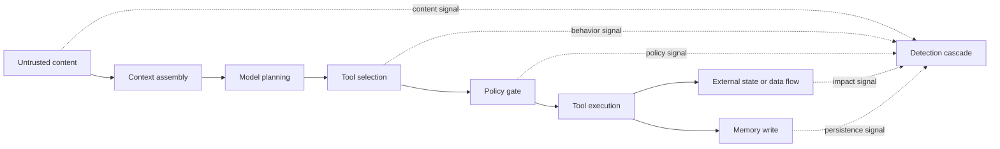

# Agent Security as a Detection Architecture

## The central idea

Prompt injection is an input technique. Security impact happens when the surrounding system grants that input a path to data, identity, tools, memory, or external action. Detection should therefore combine model signals with system telemetry and policy context.

## Detection layers

### Content

Cheap and early, but intent language is ambiguous and attackers adapt. Use as one signal, not as an authorization boundary.

### Behavior

Tool choices, sequences, arguments, destinations, and cross-system transitions often align more closely with impact. They require structured telemetry.

### Policy

Identity, permissions, user intent, destination allowlists, data classification, and approval state support deterministic decisions. Keep critical enforcement outside the model.

### Impact

External state change and sensitive-data movement are high-value signals but can be too late for prevention. They are essential for incident confirmation and feedback labels.

## Practical design rule

Prefer a cascade: deterministic policy first, inexpensive model second, contextual investigation for uncertain high-impact cases, and deterministic enforcement last.
